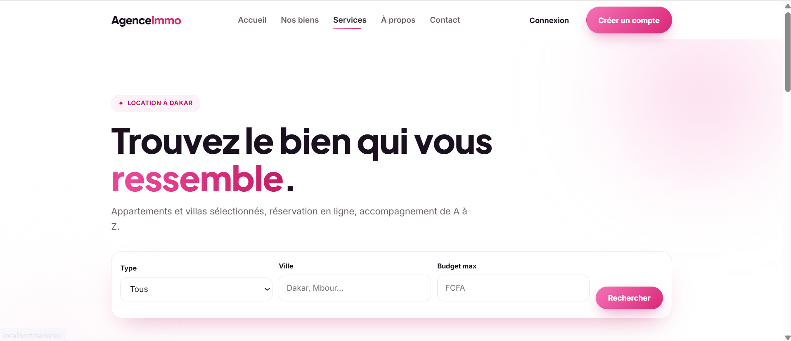
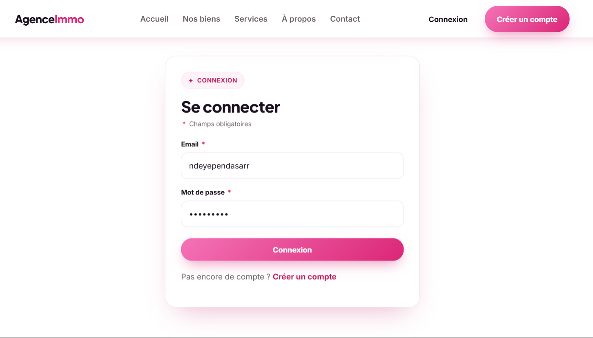
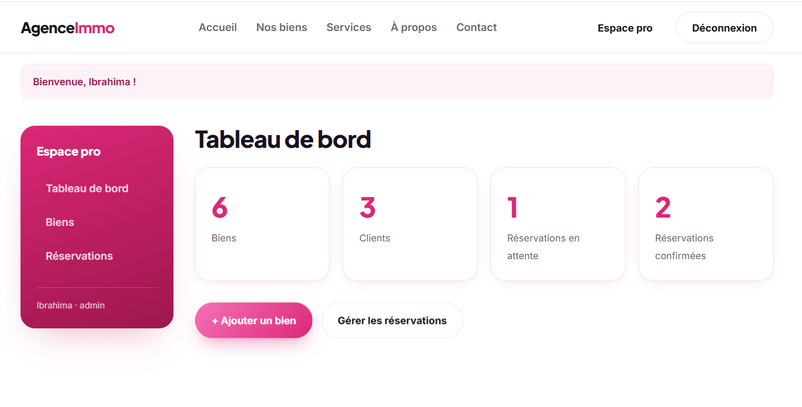
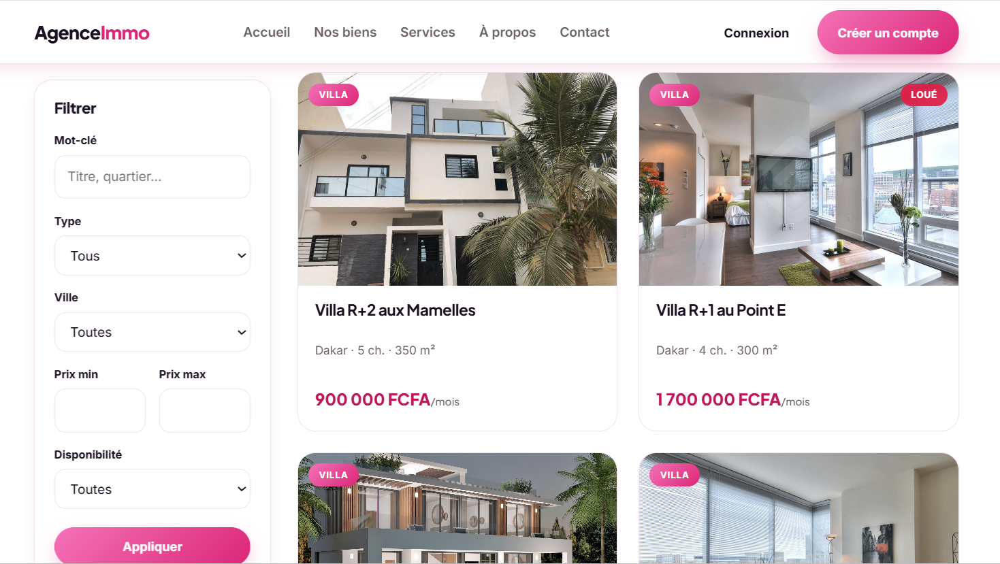
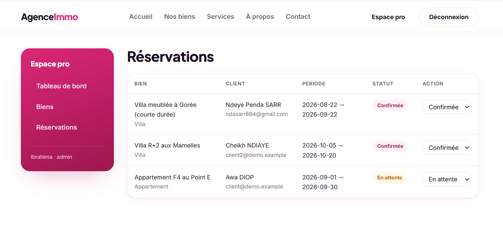

# 🏠 AgenceImmo — Gestion locative immobilière (PHP)

Application web de gestion d'agence immobilière : consultation et recherche de
biens (appartements et villas), réservation en ligne par les clients, et espace
professionnel pour la gestion des biens et des réservations.

> **Contexte.** Projet initialement réalisé en **Licence 2 (2023)**, puis
> **entièrement repensé en 2026** : refonte de l'architecture (MVC, PDO,
> séparation des responsabilités), **renforcement de la sécurité sur les
> principaux vecteurs d'attaque** (contrôle d'accès par rôle, CSRF, XSS,
> uploads contrôlés, sessions durcies) et ajout de **règles métier**
> (disponibilité vérifiée en transaction, validation serveur).

---

## 📸 Aperçu

| Accueil | Catalogue des biens |
| --- | --- |
|  |  |

| Connexion | Tableau de bord (espace pro) |
| --- | --- |
|  |  |

| Mes réservations (client) | Gestion des réservations (admin) |
| --- | --- |
|  |  |

---

## ✨ Fonctionnalités

**Visiteur** — accueil, recherche filtrée (type, ville, budget, disponibilité),
pagination, fiche détaillée avec galerie photos.

**Client** (compte) — favoris, **réservation en ligne avec vérification de
disponibilité** (pas de chevauchement de dates), historique et annulation de ses
réservations, gestion de compte.

**Commercial / Admin** (espace pro) — tableau de bord (KPIs), **CRUD des biens**
avec upload d'images sécurisé, gestion des réservations (confirmer / annuler).

---

## 🧱 Architecture

Application **MVC en PHP natif** (sans framework, pour montrer la maîtrise des
fondamentaux), structurée comme une application professionnelle :

```
public/            # seul dossier exposé (front controller + assets)
  index.php        # point d'entrée unique
src/
  Core/            # Router, Database (PDO), View, Auth, Csrf, Validator,
                   # Upload, Flash, Controller, helpers
  Controllers/     # logique par domaine (+ Controllers/Admin)
  Repositories/    # accès aux données (requêtes préparées uniquement)
views/             # templates PHP + layout + partials
config/            # configuration (lue depuis .env)
database/          # schema.sql + seed.sql
routes.php         # déclaration des routes
```

Le flux d'une requête : `index.php → Router → Controller → Repository (PDO) →
View`. Chaque couche a une responsabilité unique.

### Stack

| Composant     | Choix                                             |
| ------------- | ------------------------------------------------- |
| Langage       | PHP 8.1+ (typé, `declare(strict_types=1)`)        |
| Base          | MySQL / MariaDB via **PDO** (requêtes préparées)  |
| Autoloading   | **PSR-4** (Composer, avec repli sans dépendance)  |
| Front         | HTML5 + CSS moderne (responsive), JS vanilla      |

---

## 🔐 Sécurité

- **Contrôle d'accès par rôle** (`client` / `commercial` / `admin`) — chaque
  action sensible est protégée par `Auth::requireLogin()` /
  `Auth::requireRole()`. C'était la faille n°1 de la version d'origine.
- **Requêtes préparées** partout (aucune concaténation de données dans le SQL).
- **Protection CSRF** sur tous les formulaires POST (jeton par session, vérifié
  côté serveur, comparaison à temps constant).
- **Échappement systématique** en sortie via le helper `e()` (anti-XSS).
- **Uploads contrôlés** : type MIME réel vérifié (`finfo`), taille limitée, et
  fichier enregistré sous un **nom aléatoire sans conserver l'extension fournie**
  par l'utilisateur. Le dossier `public/uploads/` **interdit explicitement
  l'exécution de scripts** (`.htaccess`), en défense de profondeur.
- **Mots de passe** hachés avec `password_hash()` / `password_verify()`.
- **Sessions durcies** : cookie `HttpOnly` + `SameSite`, et
  `session_regenerate_id()` à la connexion (anti-fixation).
- **Erreurs** loggées côté serveur, jamais exposées au visiteur en production.

## 🧠 Règles métier

- **Réservation atomique (anti-race condition)** : la vérification de
  disponibilité et l'insertion s'exécutent dans **une même transaction**, sous
  un **verrou sur la ligne du bien** (`SELECT ... FOR UPDATE`) — deux demandes
  simultanées sur le même bien sont sérialisées, ce qui empêche deux
  réservations de se chevaucher.
- **Disponibilité** : une réservation est refusée si le bien n'est pas
  `disponible`, ou si sa période **chevauche** une réservation active
  (`date_debut <= :fin AND :debut <= date_fin`).
- **Validation serveur** : dates (format valide, début non passé, fin après
  début) et valeurs numériques bornées (prix, chambres, surface ≥ 0).
- **Confirmation sûre côté admin** : confirmer une réservation **revalide**
  l'absence de conflit avec une autre réservation déjà confirmée (transaction).
- **Archivage plutôt que suppression** : un bien retiré est **archivé** (masqué
  du site public) et non effacé — l'historique des réservations est préservé.
- **Isolation des données** : un client ne voit et n'annule que **ses**
  réservations (retours distincts : introuvable / non autorisée / déjà annulée).

## 🗄️ Modèle de données (refondu)

Les tables `Appartements` et `Villas` (dupliquées) sont unifiées en **`biens`**
(colonne `type`), et les trois tables d'authentification en **`utilisateurs`**
(colonne `role`). Clés étrangères, contraintes d'unicité (favoris) et index sont
en place.

```
utilisateurs (role, statut)
biens (type, statut) ─┬─ images (principale)
                      ├─ favoris        ── utilisateurs
                      └─ reservations ──┬─ utilisateurs
                                        └─ paiements
```

---

## 🚀 Installation

**Prérequis :** PHP 8.1+, MySQL/MariaDB. (XAMPP/WAMP/MAMP conviennent.)

```bash
# 1. Base de données
mysql -u root -p < database/schema.sql
mysql -u root -p < database/seed.sql

# 2. Configuration
cp .env.example .env      # puis renseigner DB_USER / DB_PASS

# 3. Lancer (serveur intégré PHP)
php -S localhost:8000 -t public
```

Rendez-vous sur `http://localhost:8000`.
En production Apache, servez le dossier `public/` comme racine (un `.htaccess`
est fourni).

### Comptes de démonstration

Ces comptes sont **fictifs** et n'existent que dans le jeu de données de
démonstration (`seed.sql`), pour tester l'application **en local**. Ils ne
donnent accès à aucune instance réelle. Mot de passe commun : **`Demo1234!`**.

| Rôle       | Email                       |
| ---------- | --------------------------- |
| Client     | `client@demo.example`       |
| Commercial | `commercial@demo.example`   |
| Admin      | `admin@demo.example`        |

> Aucun compte ni identifiant réel ne figure dans ce dépôt. Sur un déploiement
> réel, remplacez ce jeu de démonstration et régénérez les secrets.

---

## ✅ Points de qualité

- Code typé, `declare(strict_types=1)`, PSR-4.
- Séparation nette contrôleur / données / vue.
- Tous les fichiers passent `php -l` sans erreur.
- Échappement de sortie vérifié (les entrées `<script>` ressortent neutralisées).

## 🔭 Pistes d'amélioration

Axes identifiés pour une mise en production, volontairement hors du périmètre
d'un projet de démonstration :

- **Limitation des tentatives de connexion** (rate limiting par IP + email) pour
  se prémunir du bruteforce.
- **Durcissement supplémentaire des uploads** : contrôle des dimensions
  (`getimagesize`), plafond du nombre d'images par requête et **ré-encodage**
  systématique (GD/Imagick) pour neutraliser tout contenu caché.
- **Sessions** : `session.use_strict_mode`, expiration sur inactivité, et
  ré-évaluation du rôle depuis la base plutôt que depuis la session seule.
- **Tests automatisés** (PHPUnit) sur l'authentification, les autorisations et
  les règles de réservation.

---

Développé par **Ndeye Penda Sarr** — projet L2 (2023) modernisé en 2026.